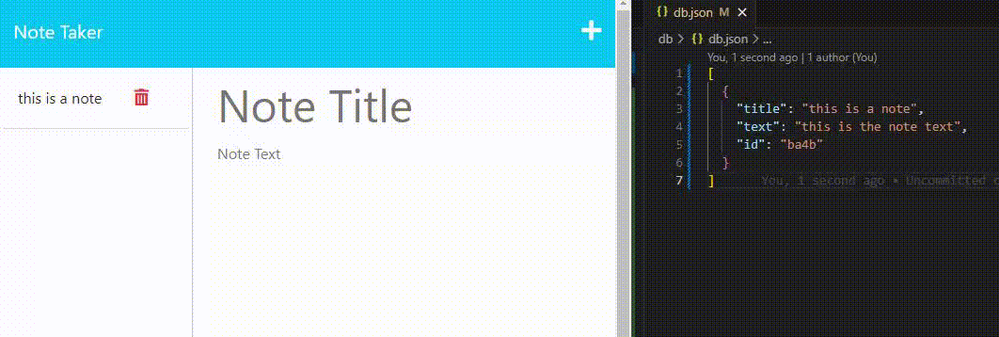
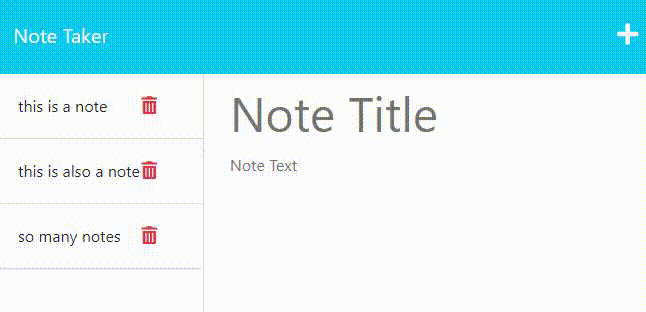
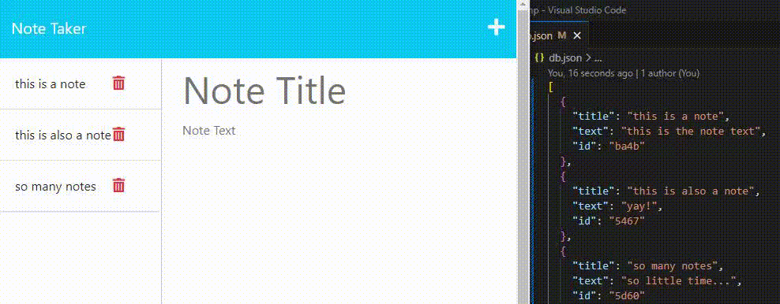

# Express Note Taker

## Description

A lightweight express.js based note taking application.

I wanted to learn more about using express.js for running web applications server-side and a note taking application was a great vehicle for that as becoming more comfortable with GET/POST/DELETE requests was vital in making the app function properly.

---

## Installation

To run the application you'll need to do the following:

- Clone the repository to your local machine
- Navigate to the project repository
- Type `npm install` in the terminal to install dependencies
- Type `node server.js` to run the server locally

---

## Usage

A short video demonstration can be found here: HAVENT DONE THIS YET

After visiting the deployed url or running the server locally using node there are a few base functions available to users.

---

You can add a note to the list by typing content in both the 'Note Title' and 'Note Text' fields then click the save icon on the top right. This will save the note to the db.json file and render the note title on the left panel of the page.

---

Clicking on a note in the sidebar will focus that specific note, populating the area on the right panel.

---

You can also delete a note from the list by simply clicking the red trash can icon to the right of the note title on the left panel of the page. Doing so will remove the note from the db.json file and as a result remove the note from the left panel of the page.

---

## Technologies

Express.js - Used as a framework for back-end API requests.

---